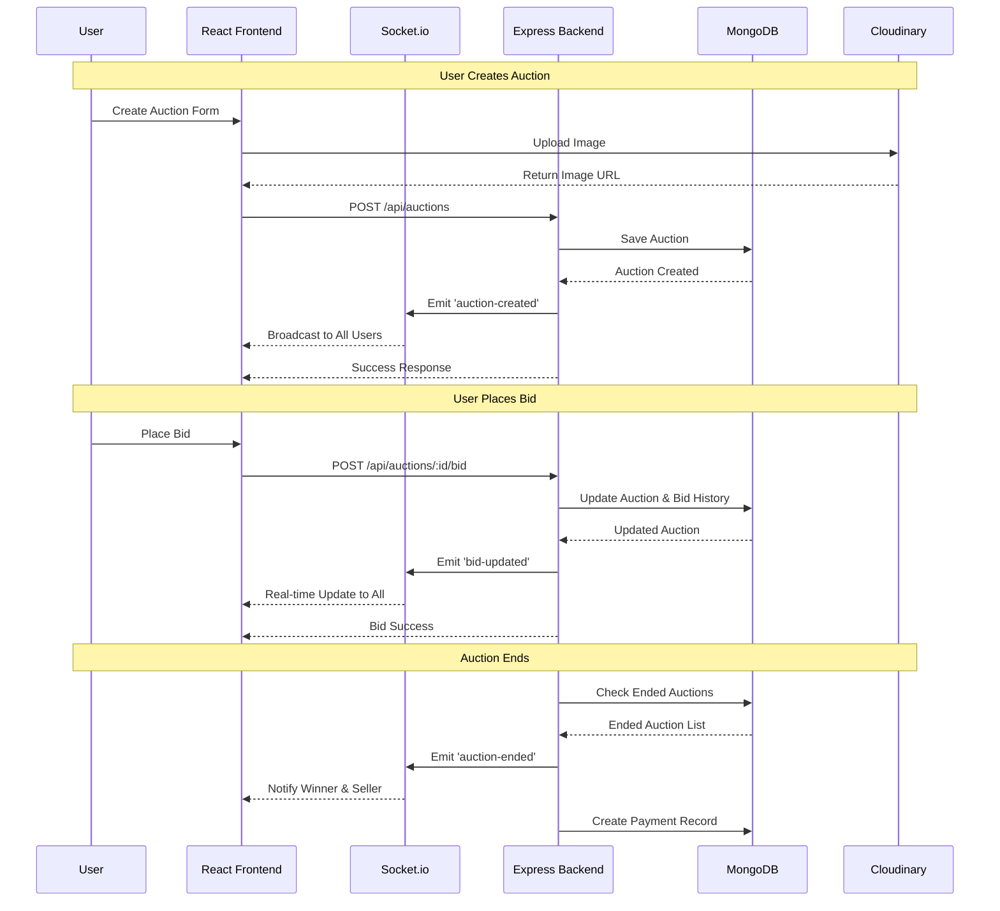

# AuctionIT💸 - Campus Marketplace & Auction Platform

> A real-time auction platform that allows users to create, bid, and manage auctions with live updates. Designed for a campus/hostel marketplace where students can buy or sell used items interactively.

[](https://www.mongodb.com/)
[](https://expressjs.com/)
[](https://reactjs.org/)
[](https://nodejs.org/)
[](https://socket.io/)
[](https://tailwindcss.com/)

---

## ✨ Features

### 🔥 Core Features

- **Real-time Bidding**: Live auction updates using WebSocket (Socket.io)
- **User Authentication**: Secure JWT-based authentication system
- **Auction Management**: Create, browse, and participate in live auctions
- **Bid History**: Track all bids with real-time updates
- **Payment Integration**: Built-in payment tracking and order management
- **Notifications**: Real-time notifications for bids, auction endings, and payments
- **Image Upload**: Cloudinary integration for auction item images
- **Responsive Design**: Mobile-first design with Tailwind CSS

### 🎨 User Experience

- **Live Auction Rooms**: Real-time bidding with instant updates
- **Category Filters**: Search and filter by categories
- **User Dashboard**: Track your auctions, bids, payments, and orders
- **Payment Methods**: Support for UPI and bank transfers
- **Auction Timer**: Visual countdown for ending auctions
- **Bid Validation**: Minimum bid increments and automatic winner selection

### 🔒 Security

- **JWT Authentication**: Secure token-based authentication
- **Password Hashing**: BCrypt encryption for user passwords
- **Protected Routes**: Middleware-based route protection
- **CORS Configuration**: Secure cross-origin requests
- **Helmet.js**: Enhanced security headers

---

## 🏗 AData Flow Architecture



---

## 🛠 Tech Stack

<div align="center">

<table>
<tr>
<td width="50%" valign="top">

### Frontend

| Technology           | Purpose                 | Version |
| -------------------- | ----------------------- | ------- |
| **React**            | UI Framework            | 19.1.1  |
| **Vite**             | Build Tool & Dev Server | 7.1.7   |
| **Tailwind CSS**     | Utility-first CSS       | 4.1.16  |
| **Socket.io Client** | Real-time Communication | 4.8.1   |
| **Axios**            | HTTP Client             | 1.12.2  |
| **React Router**     | Client-side Routing     | 7.9.4   |
| **Framer Motion**    | Animations              | 12.1.1  |
| **Lucide React**     | Icons                   | 0.476.0 |

</td>
<td width="50%" valign="top">

### Backend

| Technology     | Purpose               | Version |
| -------------- | --------------------- | ------- |
| **Node.js**    | Runtime Environment   | >= 18.x |
| **Express**    | Web Framework         | 5.1.0   |
| **MongoDB**    | Database              | >= 6.x  |
| **Mongoose**   | ODM                   | 8.19.2  |
| **Socket.io**  | Real-time Engine      | 4.8.1   |
| **JWT**        | Authentication        | 9.0.2   |
| **BCrypt**     | Password Hashing      | 5.2.0   |
| **Cloudinary** | Image Storage         | 2.8.0   |
| **Helmet**     | Security Headers      | 8.1.0   |
| **CORS**       | Cross-Origin Requests | 2.8.5   |

</td>
</tr>
</table>

</div>

---

## 📦 Installation

### Prerequisites

- Node.js (v18 or higher)
- MongoDB (v6 or higher)
- npm or yarn
- Cloudinary account (for image uploads)

### Clone Repository

```bash
git clone https://github.com/naman-kalwani/AuctionIT.git
cd AuctionIT
```

### Backend Setup

```bash
cd backend
npm install
```

Create `.env` file in `backend/` directory:

```env
PORT=5000
MONGO_URI=mongodb://localhost:27017/auctionit
JWT_SECRET=your_super_secret_jwt_key_here
CLOUDINARY_CLOUD_NAME=your_cloudinary_cloud_name
CLOUDINARY_API_KEY=your_cloudinary_api_key
CLOUDINARY_API_SECRET=your_cloudinary_api_secret
CORS_ORIGIN=http://localhost:5173
```

Start backend server:

```bash
npm start
# or for development with auto-reload
npm run dev
```

### Frontend Setup

```bash
cd frontend
npm install
```

Create `.env` file in `frontend/` directory:

```env
VITE_API_URL=http://localhost:5000
```

Start frontend development server:

```bash
npm run dev
```

The application will be available at:

- **Frontend**: http://localhost:5173
- **Backend**: http://localhost:5000

---

## 🔐 Environment Variables

### Backend (.env)

| Variable                | Description               | Example                               |
| ----------------------- | ------------------------- | ------------------------------------- |
| `PORT`                  | Server port               | `5000`                                |
| `MONGO_URI`             | MongoDB connection string | `mongodb://localhost:27017/auctionit` |
| `JWT_SECRET`            | Secret key for JWT tokens | `your_secret_key`                     |
| `CLOUDINARY_CLOUD_NAME` | Cloudinary cloud name     | `your_cloud_name`                     |
| `CLOUDINARY_API_KEY`    | Cloudinary API key        | `123456789012345`                     |
| `CLOUDINARY_API_SECRET` | Cloudinary API secret     | `your_api_secret`                     |
| `CORS_ORIGIN`           | Allowed frontend origin   | `http://localhost:5173`               |

### Frontend (.env)

| Variable       | Description          | Example                 |
| -------------- | -------------------- | ----------------------- |
| `VITE_API_URL` | Backend API base URL | `http://localhost:5000` |

---

## 🚀 Usage

### 1. Create an Account

- Navigate to the signup page
- Enter username, email, and password
- Login with your credentials

### 2. Browse Auctions

- View live auctions on the home page
- Filter by categories
- Search by title

### 3. Create an Auction

- Click "Create Auction" button
- Fill in auction details (title, description, category, base price, end time)
- Upload an image
- Submit to start the auction

### 4. Place Bids

- Click on any active auction
- Enter your bid amount (must be higher than current bid)
- Submit your bid
- Watch real-time updates as others bid

### 5. Manage Payments

- View pending payments in the Payments section
- Add payment method (UPI or Bank Transfer)
- Mark payments as completed
- Track received payments from your sales

### 6. View Orders

- Check your completed orders
- View auction details and payment information
- Access seller contact information

---

## 📁 Project Structure

```
AuctionIT/
├── backend/
│   ├── models/
│   │   ├── User.js              # User schema
│   │   ├── Auction.js           # Auction schema
│   │   ├── Payment.js           # Payment schema
│   │   └── Notification.js      # Notification schema
│   ├── routes/
│   │   ├── authRoutes.js        # Authentication routes
│   │   ├── auctionRoutes.js     # Auction CRUD routes
│   │   ├── paymentRoutes.js     # Payment routes
│   │   └── notificationRoutes.js # Notification routes
│   ├── middleware/
│   │   └── verifyToken.js       # JWT verification middleware
│   ├── index.js                 # Express server & Socket.io setup
│   ├── package.json
│   └── .env
│
├── frontend/
│   ├── src/
│   │   ├── components/
│   │   │   ├── Navbar.jsx       # Navigation bar
│   │   │   ├── Footer.jsx       # Footer component
│   │   │   ├── AuctionList.jsx  # Auction listing
│   │   │   ├── AuctionRoom.jsx  # Live auction room
│   │   │   ├── CreateAuction.jsx # Create auction form
│   │   │   ├── BidHistory.jsx   # Bid history display
│   │   │   ├── NotificationPanel.jsx # Notification dropdown
│   │   │   └── ui/
│   │   │       └── Loaders.jsx  # Loading components
│   │   ├── pages/
│   │   │   ├── LandingPage.jsx  # Landing page
│   │   │   ├── Home.jsx         # Main auctions page
│   │   │   ├── Login.jsx        # Login page
│   │   │   ├── SignUp.jsx       # Signup page
│   │   │   ├── Payments.jsx     # Payment management
│   │   │   ├── Orders.jsx       # Order history
│   │   │   └── PaymentOptions.jsx # Payment settings
│   │   ├── context/
│   │   │   ├── AuthContext.jsx  # Auth state management
│   │   │   └── useAuth.js       # Auth hook
│   │   ├── api.js               # Axios configuration
│   │   ├── socket.js            # Socket.io client setup
│   │   ├── App.jsx              # Main app component
│   │   ├── main.jsx             # Entry point
│   │   └── index.css            # Global styles
│   ├── public/
│   ├── package.json
│   ├── vite.config.js
│   └── .env
│
└── README.md
```

---

## 🔌 API Endpoints

### Authentication

| Method | Endpoint           | Description     | Auth Required |
| ------ | ------------------ | --------------- | ------------- |
| POST   | `/api/auth/signup` | Create new user | ❌            |
| POST   | `/api/auth/login`  | Login user      | ❌            |

### Auctions

| Method | Endpoint                | Description        | Auth Required |
| ------ | ----------------------- | ------------------ | ------------- |
| GET    | `/api/auctions`         | Get all auctions   | ✅            |
| GET    | `/api/auctions/:id`     | Get single auction | ✅            |
| POST   | `/api/auctions`         | Create new auction | ✅            |
| POST   | `/api/auctions/:id/bid` | Place a bid        | ✅            |

### Payments

| Method | Endpoint                      | Description          | Auth Required |
| ------ | ----------------------------- | -------------------- | ------------- |
| GET    | `/api/payments`               | Get user payments    | ✅            |
| POST   | `/api/payments/:id/mark-paid` | Mark payment as paid | ✅            |

### Payment Methods

| Method | Endpoint                   | Description              | Auth Required |
| ------ | -------------------------- | ------------------------ | ------------- |
| GET    | `/api/payment-methods`     | Get user payment methods | ✅            |
| POST   | `/api/payment-methods`     | Add payment method       | ✅            |
| PUT    | `/api/payment-methods/:id` | Update payment method    | ✅            |
| DELETE | `/api/payment-methods/:id` | Delete payment method    | ✅            |

### Orders

| Method | Endpoint      | Description     | Auth Required |
| ------ | ------------- | --------------- | ------------- |
| GET    | `/api/orders` | Get user orders | ✅            |

### Notifications

| Method | Endpoint                           | Description               | Auth Required |
| ------ | ---------------------------------- | ------------------------- | ------------- |
| GET    | `/api/notifications`               | Get user notifications    | ✅            |
| PUT    | `/api/notifications/:id/read`      | Mark notification as read | ✅            |
| PUT    | `/api/notifications/mark-all-read` | Mark all as read          | ✅            |

### Socket Events

| Event             | Direction       | Description                           |
| ----------------- | --------------- | ------------------------------------- |
| `bid-updated`     | Server → Client | Broadcast when new bid is placed      |
| `auction-ended`   | Server → Client | Broadcast when auction ends           |
| `auction-created` | Server → Client | Broadcast when new auction is created |

---

## 🎨 Features in Detail

### Real-time Bidding System

- **Live Updates**: All users see bids instantly via WebSocket
- **Bid Validation**: Ensures bids are higher than current price
- **Auto Winner Selection**: Highest bidder wins when auction ends
- **Bid History**: Complete history with timestamps and bidder names

### Payment System

- **Pending Payments**: View auctions won that need payment
- **Payment Methods**: Add UPI or bank transfer details
- **Payment Tracking**: Track both payments to make and payments received
- **Order History**: Complete record of all completed transactions

### Notification System

- **Real-time Alerts**: Instant notifications for:
  - Outbid on auctions
  - Won auctions
  - Auction endings
  - Payments received
- **Read/Unread Status**: Track which notifications you've seen
- **Filter Options**: View all or only unread notifications

### User Dashboard

- **My Auctions**: Track auctions you've created
- **My Bids**: See all auctions you're bidding on
- **Past Auctions**: View completed auctions
- **Payment Management**: Handle all payments in one place
- **Order History**: Review all purchases

---

## 📝 License

**Educational Use - Open to All**

This project is freely available for educational purposes. You are welcome to:

✅ **Use** this project for learning and educational purposes  
✅ **Modify** the code to experiment and understand MERN stack concepts  
✅ **Share** with classmates and fellow developers to learn together  
✅ **Build upon** this foundation to create your own projects

---

## 💡 Final Words

AuctionIT represents the power of modern web technologies coming together to solve real-world problems. Whether you're a student looking to learn MERN stack development or someone wanting to build a marketplace platform, we hope this project inspires and educates.

**Feel free to explore, learn, modify, and make it your own!** 🚀

If you find this project helpful, consider:

- ⭐ Starring the repository
- 🐛 Reporting issues you encounter
- 💡 Suggesting new features
- 🤝 Contributing improvements

---
